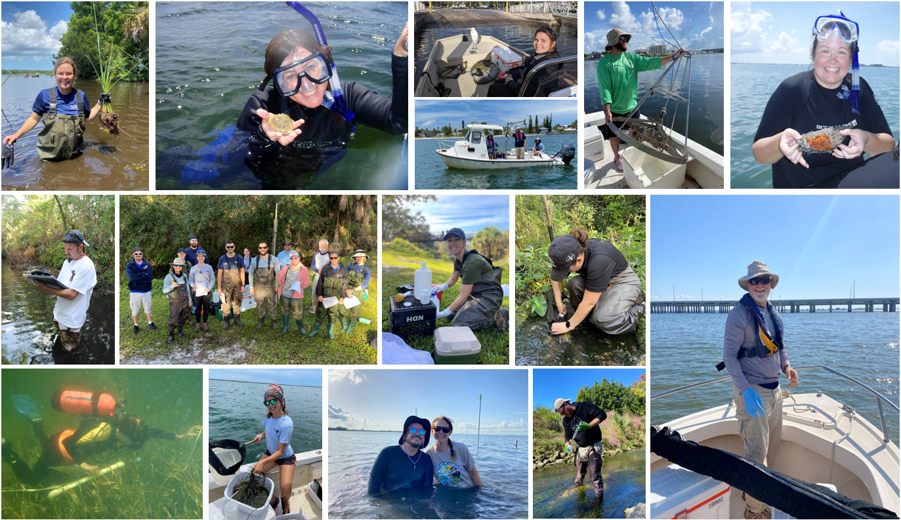

```{r setup, include=FALSE}
knitr::opts_chunk$set(echo = FALSE, message = FALSE, warning = FALSE)

# Set na.rm = TRUE for mean and geomean:
meanNA <- purrr::partial(mean, na.rm = TRUE)
geomNA <- purrr::partial(psych::geometric.mean, na.rm = TRUE)

# Get functions
source('R/funcs.R')
```

```{r data handling, include=FALSE}

# Water quality data path:
wqPath <- 'Data/Pinellas_County_Water_Quality_Data_2003_2025.xlsx'

# Import water quality data:
wqInit <- readxl::read_excel(wqPath, guess_max = 50000) |>
  dplyr::mutate(Date = as.Date(Date))

# If a secchi value is VOB, convert it NA since it doesn't represent the true
# secchi depth:
wqIn <- wqInit |>
  dplyr::mutate(Secchi = ifelse(Secchi_q %in% c('VOB', 'S'), NA, Secchi)) 

# Import FDEP WBID water quality thresholds (some of the WBID names may not exactly
# match FDEP WBID names due to Pinellas County monitoring program specifics. For 
# example, Lake Seminole is FDEP WBID 1618 but is split into 1618_N and 1618_S
# since the north and south lobes of the lake are sampled separately:
wCrit <- readxl::read_excel('Data/WBID_criteria.xlsx', sheet = 'Criteria')

# Calculate means for parameters and keep only surface level data (those are the 
# data used to generate plots in the dashboard):
wqM <- wqIn |>
  dplyr::filter(Level == 'Surface') |>
  dplyr::mutate(TN = TKN + NOX) |>
  dplyr::group_by(WBID, Date, Segment, Type) |>
  dplyr::summarise(
            DO        = meanNA(`DO%`),
            chl_a     = meanNA(`Chl-a`),
            TN        = meanNA(TN),
            TP        = meanNA(TP),
            TSS       = meanNA(TSS),
            Turbidity = meanNA(Turbidity),
            Secchi    = meanNA(Secchi),
            Temp      = meanNA(Temp_Water),
            Salinity  = meanNA(Salinity),
            Ecoli     = meanNA(E_coli),
            Entero    = meanNA(Enterococci)
            ) |>
  dplyr::ungroup()

# Read in Pinellas WBID shapefile and add site type and status. Make the WBIDs
# around Lakes Seminole and Tarpon non-interactive since they are not sampled
# and to make the Lakes easier to click:
wqShp <- sf::st_read('GIS/Waterbody_IDs_(WBIDs).shp') |>
  dplyr::select(HUC, WBID, ID = WATERBODY_, REGION = GROUP_NAME, CLASS) |>
  sf::st_transform("+proj=longlat +ellps=WGS84 +datum=WGS84") |>
  dplyr::mutate(
    geometry = sf::st_make_valid(geometry),
    Type = wqM$Type[match(WBID, wqM$WBID)],
    Type = ifelse(is.na(Type), 'NOT SAMPLED', Type),
    Status = ifelse(WBID %in% c('1558C', '1558B', '1709D', '1709F', '1716A','1696', 
                                '1603B', '1700', '1683', '1530','1624A', '1556A',
                                '1716D','1701A','1701B'), 'Inactive', 
                         ifelse(Type == 'NOT SAMPLED', 'Not Sampled', 'Active')),
    color = dplyr::case_when(
      Type == 'MARINE' & Status == 'Active' ~ '#00244c',
      Type == 'MARINE' & Status == 'Inactive' ~ '#6A5ACD',
      Type == 'LAKE' ~ '#40E0D0',
      Type %in% c('TIDAL', 'FRESHWATER') & Status == 'Active' ~ '#006400',
      Type %in% c('TIDAL', 'FRESHWATER') & Status == 'Inactive' ~ '#E69F00',
      TRUE ~ 'gray60'
    ), 
    interactive = ifelse(WBID %in% c(1486, '1618A', '1603A'), FALSE, TRUE),
    chla_crit   = wCrit$chla_crit[match(WBID,wCrit$WBID)],
    TN_crit     = wCrit$TN_crit[match(WBID,wCrit$WBID)],
    TP_crit     = wCrit$TP_crit[match(WBID,wCrit$WBID)],
    DO_crit     = wCrit$DO_crit[match(WBID,wCrit$WBID)],
    Ecoli_crit  = wCrit$Ecoli_crit[match(WBID,wCrit$WBID)],
    Entero_crit = wCrit$Entero_crit[match(WBID,wCrit$WBID)],
    Area = units::set_units(sf::st_area(geometry), mi^2)
  ) |>
  dplyr::left_join(
    wqIn |> 
      dplyr::select(Basin = Site, WBID) |>
      dplyr::mutate(Basin = substr(Basin,1,2)) |>
      dplyr::distinct(), 
    by = 'WBID'
    )

```

```{r WBID map, include=FALSE}

# Create the base map and set options:
m <- leaflet::leaflet(
  options = leaflet::leafletOptions(
    zoomControl = TRUE, 
    zoomSnap    = 0.1, 
    zoomDelta   = 1)
  ) |>
  leaflet::addTiles(attribution = '') |>
  leaflet::addProviderTiles(
    leaflet::providers$CartoDB.Positron, group = 'CartoDB.Positron'
    ) |>
  leaflet::addProviderTiles(
    leaflet::providers$Esri.WorldImagery, group = 'Esri.WorldImagery'
    ) |>
  leaflet::addProviderTiles(
    leaflet::providers$OpenTopoMap, group = 'OpenTopoMap'
    ) |>
  leaflet::setView(
    lng  = -82.72, 
    lat  = 27.905, 
    zoom = 10.6
    )

# Iterate over each unique waterbody type and add them as separate polygon layers.
# This will allow users to highlight specific different water types:
for (type in unique(wqShp$Type)) {
  m <- m |> leaflet::addPolygons(
    data        = wqShp[wqShp$Type == type & wqShp$interactive == TRUE, ],
    group       = type,  
    weight      = 0.8,
    fillOpacity = 0.3,
    stroke      = TRUE,
    color       = 'black',
    opacity     = 0.7,
    fill        = TRUE,
    fillColor   = ~color,
    label       = ~ID,
    popup       = ~create_popup(ID, REGION, Basin, HUC, WBID, Area, CLASS, Type, 
                                Status, DO_crit, chla_crit, TN_crit, TP_crit, 
                                Ecoli_crit, Entero_crit),
    highlightOptions = leaflet::highlightOptions(
      color = 'white', 
      weight = 4,
      opacity = 0.5)
    ) 
}

# Custom legend for WBID types:
wqLeg <- leg(
  shape  = 'rect', 
  n      = 6, 
  colors = c('#00244c', '#6A5ACD', '#40E0D0', '#006400', '#E69F00', '#696969'),
  fOp    = 0.5, 
  h      = 20, 
  w      = 20
  )

# Add other elements to the map:
m <- m |> 
  leaflet::addPolygons(
    data        = wqShp[wqShp$WBID == '1486A', ],
    layerId     = 'shape',
    fillOpacity = 0.17,
    stroke      = TRUE,
    color       = 'green',
    fill        = TRUE,
    fillColor   = ~color,
    label       = ~ID,
    ) |> 
  leaflet::addLayersControl(
    position = "topleft",  
    baseGroups = c("CartoDB.Positron", "Esri.WorldImagery", "OpenTopoMap"),
    overlayGroups = c(unique(wqShp$Type)),
    options = leaflet::layersControlOptions(
      collapsed = TRUE)
    ) |> 
  leaflet::addPolygons(
    data             = wqShp[wqShp$interactive == FALSE, ],
    popup            = NULL,
    label            = NULL,
    highlightOptions = NULL,
    weight           = 0.8,
    fillOpacity      = 0.3,
    stroke           = TRUE,
    color            = 'black',
    opacity          = 0.7,
    fill             = TRUE,
    fillColor        = 'gray60',
    options          = leaflet::pathOptions(clickable = FALSE),
    ) |>
  leaflet::addScaleBar(
    position = 'bottomleft'
    ) |>
  leaflegend::addLegendImage(
    images      = wqLeg,
    labels      = c('Marine-Active', 'Marine-Inactive', 'Lake', 'Stream-Active', 
                    'Stream-Inactive', 'Not Sampled'),
    labelStyle  = "font-size: 14px;",
    width       = 15,
    height      = 11,
    orientation = 'vertical',
    title = htmltools::tags$div('Site Type',
                                style = 'font-size: 15px; text-align: center;
                                font-weight: bold;'),
    position = 'bottomleft'
    ) 
```

```{r get data and plots, include=FALSE}

# Get data for each WBID based on user click:
getData <- reactive({ 
  if (is.null(input$mapplo_shape_click)){
    wbid <- '1486A'
    } else {
      wbid <- getWBID(
        spDat = wqShp,
        lat   = input$mapplo_shape_click$lat, 
        lng   = input$mapplo_shape_click$lng
        )
    }
  data <- data.frame(
    dplyr::filter(wqM, WBID == wbid) |>
    dplyr::select(
      Date, DO, chl_a, TN, TP, TSS, Turbidity, Secchi, Temp, Salinity, Ecoli, Entero
      )
    )
  return(data)
  })

mapplo <- leaflet::leafletProxy('mapplo') 

# Change the highlighted WBID based on user click:
observeEvent(input$mapplo_shape_click, {
  sName <- getWBID(
    spDat = wqShp,                   
    lat   = input$mapplo_shape_click$lat,
    lng   = input$mapplo_shape_click$lng
    )
  mapplo <- mapplo |>
    leaflet::removeShape('shape') |>
    leaflet::addPolygons(
      data        = dplyr::filter(wqShp, WBID == sName),
      layerId     = 'shape',
      fillOpacity = 0.17,
      stroke      = TRUE,
      color       = dplyr::case_when(
        wqShp$Status[wqShp$WBID == sName] == 'Active' ~ 'green',
        wqShp$Status[wqShp$WBID == sName] == 'Inactive' ~ 'red',
        TRUE ~ 'gray'
      ),
      fill      = TRUE,
      fillColor = ~color,
      label     = ~ID
      )
  })

# Get the name of the WBID clicked by the user:
site <- reactive({
  if(is.null(input$mapplo_shape_click)){
    sName <- '1486A'
  } else {
    sName <- getWBID(
      spDat = wqShp,
      lat = input$mapplo_shape_click$lat,
      lng = input$mapplo_shape_click$lng
      )
  }
  return(wqShp$ID[wqShp$WBID == sName])
  })

# Dissolved oxygen plot:
DOplo <- reactive({
  return(plt(
    data = dplyr::select(getData(), Date, DO) |> tidyr::drop_na(), 
    var = 'Dissolved Oxygen \n(% sat)',
    crit = wCrit$DO_crit[wCrit$WBID == wqShp$WBID[wqShp$ID == site()]]
    ))
  })

# Chlorophyll-a plot:
chlplo <- reactive({
  return(plt(
    data = dplyr::select(getData(), Date, chl_a) |> tidyr::drop_na(), 
    var  = 'Chlorophyll-a \n(µg/L)',
    crit = wCrit$chla_crit[wCrit$WBID == wqShp$WBID[wqShp$ID == site()]]
    ))
  })

# Total nitrogen plot:
TNplo <- reactive({
  return(plt(
    data =dplyr::select(getData(), Date, TN) |> tidyr::drop_na(), 
    var ='Total Nitrogen \n(mg/L)',
    crit = wCrit$TN_crit[wCrit$WBID == wqShp$WBID[wqShp$ID == site()]]
    ))
  })

# Total phosphorus plot:
TPplo <- reactive({
  return(plt(
    data = dplyr::select(getData(), Date, TP) |> tidyr::drop_na(), 
    var  = 'Total Phosphorus \n(mg/L)',
    crit = wCrit$TP_crit[wCrit$WBID == wqShp$WBID[wqShp$ID == site()]]
    ))
  })

# Total suspended solids plot:
TSSplo <- reactive({
  return(plt(
    data = dplyr::select(getData(), Date, TSS) |> tidyr::drop_na(), 
    var  = 'Total Suspended Solids \n(mg/L)'
    ))
  })

# Turbidity plot:
NTUplo <- reactive({
  return(plt(
    data = dplyr::select(getData(), Date, Turbidity) |> tidyr::drop_na(), 
    var  = 'Turbidity \n(NTU)'
    ))
  })

# Secchi depth plot:
Secplo <- reactive({
  return(plt(
    data = dplyr::select(getData(), Date, Secchi) |> tidyr::drop_na(), 
    var  = 'Secchi Depth \n(m)'
    ))
  })

# Total phosphorus plot:
Tplo <- reactive({
  return(plt(
    data = dplyr::select(getData(), Date, Temp) |> tidyr::drop_na(), 
    var = 'Temperature \n(°C)'
    ))
  })

# Salinity plot:
Splo <- reactive({
  return(plt(
    data = dplyr::select(getData(), Date, Salinity) |> tidyr::drop_na(), 
    var  = 'Salinity \n(ppt)'
    ))
  })

# E. coli plot:
eplo <- reactive({
  return(plt(
    data = dplyr::select(getData(), Date, Ecoli) |> tidyr::drop_na(), 
    var  = HTML('<em>E. coli</em> \n(MPN/100mL)'),
    crit = wCrit$Ecoli_crit[wCrit$WBID == wqShp$WBID[wqShp$ID == site()]]
    ))
  })

# Enterococcus plot:
entplo <- reactive({
  return(plt(
    data = dplyr::select(getData(), Date, Entero) |> tidyr::drop_na(), 
    var  = HTML('<em>Enterococci</em> \n(MPN/100mL)'),
    crit = wCrit$Entero_crit[wCrit$WBID == wqShp$WBID[wqShp$ID == site()]]))
  })

# Return watershed info based on clicked WBID:
Sinf <- function(site){
  Sw <- wqShp$WBID[wqShp$ID == site()]
  if (Sw == 1440) anclote(input, 'info')
  if (Sw == 1475) hollin(input, 'info')
  if (Sw == 1474) brooker(input, 'info')
  if (Sw == 1643) church(input, 'info')
  if (Sw == 1574) alligator(input, 'info')
  if (Sw == '1527B') bee(input, 'info')
  if (Sw == '1538A') curlew(input, 'info')
  if (Sw == '1624A') roosevelt(input, 'info')
  if (Sw == '1575A') mullet(input, 'info')
  if (Sw == '1668A') joes(input, 'info')
  if (Sw == '1486A') lt(input, 'info')
  if (Sw == '1618C') cross_bayou(input, 'info')
  if (Sw %in% c(1641,1625)) cross(input, 'info')
  if (Sw %in% c(1508, '1508A')) klosterman(input, 'info')
  if (Sw %in% c(1556, '1556A')) cedar(input, 'info')
  if (Sw %in% c(1569, '1569A')) bishop(input, 'info')
  if (Sw %in% c(1604, '1604B1')) allens(input, 'info')
  if (Sw %in% c(1627, '1627B')) long(input, 'info')
  if (Sw %in% c('1618_N','1618_S')) sa_b(input, 'info',site)
  if (Sw %in% c('1558I','1558H2')) otbN(input, 'info',site)
  if (Sw %in% c('1558H','1558G')) otbS(input, 'info',site)
  if (Sw %in% c('1558F','1661')) rb(input, 'info',site)
  if (Sw %in% c('8045','1528C','1528')) sjs(input, 'info',site)
  if (Sw %in% c(1633,'1633B','1633D','1633E')) mckay(input, 'info')
  if (Sw %in% c('1528A','1694B','1694A','1558N')) bcb(input, 'info',site)
  if (Sw %in% c(1529, 1530, 1550, 1614, 1683, 1696, 1700, '1541B', '1530A',
                '1541C', '1603B', '1603D', '1574A', '1567C', '1662A', '1618D',
                '1668B', '1668D', '1558C', '1558B', '1709D', '1709F', '1716A',
                '1604B1'))
    tbd(input, 'info')
  if (Sw == 'Not Sampled') noInfo(input, 'info')
  }

```

Overview
===========================================================

## Column {.tabset .tabset-fade data-width=650}

```{r screen size modal}
# Initialize a reactive value to track if a water quality subtab has been clicked yet:
fc <- reactiveVal(TRUE)

# UI for the initial informational popup:
screen_txt <- modalDialog(
  title = "MOBILE DEVICE DETECTED",
  HTML("<b>PLEASE NOTE:</b>"),
  tags$p(""),
  HTML("It appears you are attempting to view this dashboard using a mobile device.
       This dashboard is still in development and some features may not be displayed 
       properly on a mobile device. For the best experience, please view this dashboard on a
       desktop or tablet computer."),
  easyClose = TRUE,
  footer = modalButton("Close"),
  style = "font-size:90%"
)

# Make sure initial info popup only displayed when the water quality tab is first 
# opened:
observeEvent(input$active_tab, {
  if (input$active_tab == "Overview" & input$screen_width < 800 & fc()){
    showModal(screen_txt)
    fc(FALSE) 
    }
  })
```


<div class = "row">
<div class = "col-md-2"></div>
<div class = "col-md-8">


#### WELCOME TO THE PINELLAS COUNTY WATER QUALITY DASHBOARD!

```{r, echo = FALSE, out.width = '100%', fig.align = 'center', fig.alt='Image of Fort De Soto Park with coastline'}
knitr::include_graphics('www/banner.png')
```

#### Who We Are and What We Do
The Pinellas County Division of Environmental Management (PCDEM), part of the Pinellas County Public Works Department, is committed to safeguarding environmental health through data collection and application of sound scientific principles. The Division achieves water resource goals by conducting routine water monitoring throughout the county and the surrounding coastal waters. Water samples are collected to determine chemical, physical, and biological elements of streams, lakes, and marine waters within unincorporated Pinellas County and in partnership with various municipalities. Habitat and aquatic species surveys are done at specific times of the year to monitor macroinvertebrates, phytoplankton (including red tide), and benthic and seagrass indicators. Visit our [website](https://pinellas.gov/programs/water-quality-monitoring-program/){target="_blank"} to learn more about our various habitat monitoring programs.

#### Why Water Quality Matters
Water quality is more than just a scientific measure; it's a reflection of the health of our entire ecosystem. Clean water is a home for wildlife and a playground for us – the land and water within the landscape, or watershed, is where we live, work, and play. However, sometimes, water can have too much of certain substances like nutrients, sediment, and bacteria. While nutrients are necessary for aquatic life, in excess, they can be detrimental and lead to overgrowth of algae, resulting in reduced oxygen throughout the waterbody. The process of nutrient enrichment, known as eutrophication, can harm fish and other aquatic organisms as well as block sunlight from reaching aquatic vegetation, including seagrass, and can impair their growth. Healthy seagrass and other aquatic vegetation is important for maintaining healthy levels of dissolved oxygen and providing habitat and food for many marine animal species.

#### Our Success Story – Tampa Bay
Tampa Bay continues to be recognized for water quality and habitat restoration efforts because of collaboration between government entities, academic research, and local stakeholder involvement. Over the last four decades, there has been a concerted effort to improve the bay's water quality through monitoring and adaptive management strategies. Although managing these environmental resources is a continual effort, the success of nutrient reduction in the bay is a testament to what can be achieved through persistent and coordinated environmental management.

#### This Dashboard
This dashboard is designed to make the Division’s (PCDEM) monitoring results accessible and summarize how the lakes, streams, and coastal waters measure up compared to past conditions and based on regulatory and management targets. Click on the "Water Quality" to start exploring the water quality data from sites throughout Pinellas County. 


This dashboard provides several types of data for exploration, including:

1) [__Water Quality__](#water-quality): Water quality data from monitoring sites throughout Pinellas County.
1) [__Red Tide & Beach Bacteria__](#red-tide-beach-bacteria): Current Pinellas County red tide and beach bacteria data.
1) [__Annual Report__](#annual-report): Annual report summarizing water quality and habitat monitoring data
1) [__Data Downloads__](#data-download): Downloadable water quality data.

<br>

The source content for this dashboard can be viewed on [Github](https://github.com/PCDEM/water_quality_dashboard){target="_blank"}.

Technical questions about our water quality data can be sent to [Stacey Day](mailto:sday@pinellas.gov). 
<br>
Questions and comments about the dashboard can be sent to [Alex Manos](mailto:almanos@pinellas.gov).

<br/><br/>

```{r, echo = FALSE, out.width = '60%', fig.align = 'center', fig.alt='County staff collecting data',fig.cap='Pinellas County staff conducting various types of environmental monitoring activities.'}

```

</div>
<div class = "col-md-2"></div>
</div>


Water Quality
===========================================================

## Column {.tabset .tabset-fade data-width="280"}


```{r water quality modal}
# Initialize a reactive value to track if a water quality subtab has been clicked yet:
firstClick <- reactiveVal(TRUE)

# UI for the initial informational popup:
txt <- modalDialog(
  title = "NAVIGATING THE WATER QUALITY DATA PAGE",
  HTML("<b>Getting started:</b>"),
  tags$p(""),
  tags$li("Click 'MAP' to view our sampled watersheds."),
  tags$p(""),
  tags$li("Click 'USING THIS TAB' for tab function guidance."),
  tags$p(""),
  tags$li("Click 'BACKGROUND' for general information."),
  br(),
  HTML("<b>Viewing the data:</b>"),
  tags$p(""),
  tags$li("Click any of the colored shapes (watersheds) to view plots and status."),
  tags$p(""),
  tags$li("Click the label at the top of the map for information about the watershed."),
  tags$p(""),
  tags$li("The plots are interactive; use the cursor to highlight data points."),
  tags$p(""),
  tags$li("Click through the tabs to view different water quality parameters."),
  easyClose = TRUE,
  footer = modalButton("Close"),
  style = "font-size:90%"
)

# Make sure initial info popup only displayed when the water quality tab is first 
# opened:
observeEvent(input$active_tab, {
  if (input$active_tab == "Water Quality" & firstClick()){
    showModal(txt)
    firstClick(FALSE) 
    }
  })
```


### MAP

```{r}

# Get water quality map:
output$mapplo <- leaflet::renderLeaflet(m)

# Create a UI element for the WBID info button:
output$info <- renderUI({
  tags$div(id="info-btn-container",
           actionButton("info", 
                        label = HTML(paste0("<i class='fas fa-info-circle'></i> ", 
                                            site())),
                        style = paste0('font-size:', input$screen_width/115, 'px'), 
                        class = "btn"))
})

# Display the map and info button:
fillCol(flex = c(NA, 1, 1),
        uiOutput('info'),
        leaflet::leafletOutput('mapplo'))

# Change watershed info button name:
observeEvent(input$info, {
  Sinf(site())
})

# UI for the initial informational popup:
nsModal <- modalDialog(
  title = "NOTICE",
  HTML("<b>Pinellas County discontinued water quality sampling in this area in 2012. For more recent data please contact the City of St. Petersburg Public Works at waterdept@stpete.org.</b>"),
  easyClose = TRUE,
  footer = modalButton("Close")
)

# Display a special message for WBIDs in St. Petersburg:
observeEvent(input$mapplo_shape_click, {
  if (site() %in% c('SMACKS BAYOU', 'TAMPA BAY (UPPER SEGMENT)', 'TAMPA BAY (MIDDLE SEGMENT)',
                    'BOOKER CREEK', 'COFFEEPOT BAYOU', '34TH STREET BASIN',
                    'FRENCHMANS CREEK - BASIN U', 'BAYOU CREEK')) {
    showModal(nsModal)
  }
})

```


### USING THIS TAB

#### Overview
This tab shows water quality data located around Pinellas
County, encompassing both marine and freshwater habitats. The PCDEM
utilizes two methods for water quality sampling: fixed sites for streams and
stratified random sampling for lakes and coastal waterways.

<br> 

#### Navigating the Map
Use the cursor to hover over the sites on the Map tab and click to view water
quality data for that site. Refer to the legend on the bottom left of the map which
denotes both the type of water body and the status of monitoring activity within 
that area. There are coastal, lake, stream, and sites which are not sampled, of which may be inactive (previous monitoring conducted, but none currently) or have never been sampled by PCDEM.

<br>
```{r, fig.align = 'center', out.width = '30%', fig.alt='Map legend'}

```
<br>

Click the informational button at the top right of the map to view more information
about the selected site. 

<br>

#### Viewing the Data
To view the data, click the site of interest and the graphs to the right will
display historical data for the site, if available. There are several tabs that
display different types of water quality data. The panel to the far right displays
a gauge for the threshold criteria used by the Florida Department of Environmental
Protection (FDEP) for water quality standards. The gauge is color-coded to show
the status of the water quality for the selected parameter: green is within acceptable
limits and red is exceeding the limit.

The time-series plots are interactive; the cursor can be used to view the date and 
data for each point and highlight different portions of the plot. A
[control menu](https://help.plot.ly/zoom-pan-hover-controls/){target="_blank"} will also
appear when moving the cursor inside the plot area.

<br>
```{r, fig.align = 'center', out.width = '70%', fig.alt='Plot control menu options'}
knitr::include_graphics('www/plotcontrols.PNG')
```
<br>

Use this menu to zoom, pan, and download the plot as a png file.

<br> 

#### Report Card
The Report Card tab displays a "Pass/Fail" classification for selected parameters
at the selected site over the period-of-record data. For more information about 
the specific criteria used or the calculations involved, please visit out Github 
page which can be accessed by clicking the "Source Code" button at the top of the 
dashboard.

<br> 

### BACKGROUND

#### Land-Based Sites

The fixed, land-based sites (green dots on map below) are located in streams, ditches,
canals, and small lakes around the county. The county is divided into 52
watersheds (the land area that drains into a receiving body of water) and these fixed sites are selected in a way to maximize the coverage area for sampling. The shapes on the watershed map are divided into water body identification numbers (WBIDs), as defined by the [Florida Deparment of Environmental Protection (FDEP)](https://floridadep.gov/dear/watershed-assessment-section/content/basin-411-0){target="_blank"}. These WBIDs help scientists and regulators focus management efforts on specific locations based on the impairment of the water body within each WBID boundary. If two or more water quality sites are located within the same WBID, the data from these sites are averaged to represent the water quality for that WBID and is displayed in the graphs. Click the Data Downloads tab to view site-specific data.

<br>
```{r, fig.align = 'center', out.width = '70%', fig.alt = 'Map of Pinellas County with land-based water quality sites'}

```
<br>

#### Coastal Marine Sites

Water quality is also monitored in the coastal waters and lakes (Lakes Tarpon and Seminole) and follow a similar design to the FDEP WBID with the exception of a few sites which combine/divide WBIDs. On the map tab, marine waters are dark blue and the lakes are light blue. The figure below shows the distribution of
these sampling areas (strata). However, sites E6 And E7 (Middle Tampa Bay) are part of the City of St.
Petersburg water quality monitoring program and are not included in the
counties geographic coverage. Similarly water quality data is not collected by PCDEM in any of the streams or lakes in St. Petersburg. Please contact the [City of St. Petersburg](https://www.stpete.org/){target="_blank"} for more information on their water quality monitoring program.


<br>
```{r, fig.align = 'center', out.width = '70%', fig.alt = 'Map of Pinellas County with coastal water quality sites'}

```
<br>

#### Sampling Design

The strata sites (as well as the land sites) are sampled eight times a year (given
adequate conditions). Since the strata sites are selected based on a
[stratified random sampling design](https://www.epa.gov/quality/selecting-sampling-design#str){target="_blank"}, the sites within each stratum are different during
each sampling event. Each stratum is divided into equally sized hexagons
as shown below for stratum W8.

<br>
```{r, fig.align = 'center', out.width = '70%', fig.alt = 'Grid of hexagons showing sampling design'}

```
<br>

A computer program is then used to randomly select points within each
hexagon with equal probability provided to each hexagon. For each sampling event, 
four points are selected throughout the individual stratum and are labeled A, B, C, 
and D. The data displayed for the stratum on the time-series plots are an average 
of those four points. Click the "Data Downloads" tab to view site-specific data. 
For more information on our water quality sampling design, types of data collected,
long-term water quality trends, and summary statistics click on the "Annual Report" tab.


## Column {.tabset .tabset-fade data-width="610"}

### Oxygen, Nutrients, & Chlorophyll-a

```{r}
# Display the data for DO, chl_a, TN, and TP
fillCol(flex = c(1, rep(1, 4)),
        pltmsg(getData, "DO", DOplo),
        pltmsg(getData, "chl_a", chlplo),
        pltmsg(getData, "TN", TNplo),
        pltmsg(getData, "TP", TPplo))
```

### Water Clarity

```{r}
# Display the data for TSS, turbidity, and Secchi. Secchi not collected on stream 
# sites, only lakes and coastal water:
fillCol(flex = c(1, rep(1, 3)),
    pltmsg(getData, "TSS", TSSplo),
    pltmsg(getData, "Turbidity", NTUplo),
    pltmsg(getData, "Secchi", Secplo))
```

### Temperature & Salinity

```{r}
# Display the data for temperature and salinity:
fillCol(flex = c(1, rep(1, 3)),
    pltmsg(getData, "Temp", Tplo),
    pltmsg(getData, "Salinity", Splo))
```

### Bacteria

```{r}
# Bacteria samples only collected in freshwater and tidal stream sites:
fillCol(flex = c(1, rep(1, 2)),
    pltmsg(getData, "Ecoli", eplo),
    pltmsg(getData, "Entero", entplo))
```

### Report Card

```{r}
# Create slider input to narrow down the report card:
sliderInput('year', 'Select year range', 
            min   = 2003, 
            max   = lubridate::year(Sys.Date()) - 1,
            value = c(2003, lubridate::year(Sys.Date()) - 1), 
            step  = 1, 
            sep   = "",
            width = '95%')

# Update the slider with the years available at each site:
observe({
  
  # set the max year for the slider:
  mxSldYr <- max(lubridate::year(getData()$Date))
  
  # Update the slider input with the min and max years:
  updateSliderInput(
      session, 'year', 
      min = min(lubridate::year(getData()$Date)),
      max = dplyr::case_when(
        mxSldYr == lubridate::year(Sys.Date()) ~ mxSldYr - 1,
        TRUE ~ mxSldYr
      ),
      value = c(min(lubridate::year(getData()$Date)),
                dplyr::case_when(
                  mxSldYr == lubridate::year(Sys.Date()) ~ mxSldYr - 1,
                  TRUE ~ mxSldYr
                )
           ) 
      )
  })

# WBID specific pass/fail summary:
rcd <- reactive({

  # Select the data used for the report card:
  rd <- wqIn |>
    dplyr::filter(WBID == wqShp$WBID[wqShp$ID == site()]) |>
    dplyr::filter(Level == 'Surface') |>
    dplyr::select(Date, WBID, Type, `Chl-a`, `DO%`, TKN, NOX, TP, E_coli, Enterococci) |>
    dplyr::mutate(TN = TKN + NOX) |>
    dplyr::group_by(Date, WBID, Type) |>
    dplyr::summarise_if(is.numeric, meanNA)
  
  # Calculate the 10% exceedance criteria for DO:
  do <- rd |>
    dplyr::group_by(Year = lubridate::year(Date), Type) |>
    dplyr::filter(Year != lubridate::year(Sys.Date())) |>
    dplyr::reframe(
      total_samples = dplyr::n(),
      n_below = dplyr::case_when(
        Type == 'MARINE' ~ length(which(`DO%` < 42)),
        TRUE ~ length(which(`DO%` < 38))
      )) |>
    dplyr::distinct() |>
    dplyr::mutate(do_grade = ifelse((n_below/total_samples) >= 0.1, 'Fail', 'Pass'))
  
  # The annual exceedance limits have differing calculations based on specific
  # WBIDs according to FDEP criteria. Some of the coastal sites using geometric
  # mean for chl-a, TP, and TN, while other coastal sites use the geometric mean
  # for nutrient and arithmetic mean for chl-a.
  if (! unique(rd$WBID) %in% c('1558I','1558H','1558H2','1558G','1558F', 1661,
                               '1528A', '1558N','1694A','1694B','1618C','1558B',
                               '1558C')) {
    repo <- rd |>
      dplyr::select(-`DO%`) |>
      dplyr::group_by(WBID, Year = lubridate::year(Date)) |>
      dplyr::summarise_if(is.numeric, psych::geometric.mean, na.rm = TRUE)
    } else {
      repo <- rd |>
        dplyr::select(-`DO%`) |>
        dplyr::group_by(WBID, Year = lubridate::year(Date)) |>
        dplyr::summarise(`Chl-a`     = meanNA(`Chl-a`),
                         TN          = psych::geometric.mean(TN),
                         TP          = psych::geometric.mean(TP),
                         `E_coli`    = psych::geometric.mean(E_coli),
                         Enterococci = psych::geometric.mean(Enterococci)) 
  }
  
  # Filter the water quality criteria for the selected site:
  wbC <- wCrit |>
    dplyr::filter(WBID == wqShp$WBID[wqShp$ID == site()])
    
  # Convert the data to pass/fail score based on the WBID criteria and adjust
  # the data based on the slider input:
  rc <- repo |>
    dplyr::ungroup() |>
    dplyr::mutate(
      chl_grade    = ifelse(`Chl-a` >= wbC$chla_crit, 'Fail', 'Pass'),
      tp_grade     = ifelse(TP >= wbC$TP_crit,'Fail','Pass'),
      tn_grade     = ifelse(TN >= wbC$TN_crit,'Fail','Pass'),
      ecoli_grade  = ifelse(E_coli >= wbC$Ecoli_crit,'Fail','Pass'),
      entero_grade = ifelse(Enterococci >= wbC$Entero_crit,'Fail','Pass')) |>
    dplyr::left_join(do |> dplyr::select(Year, do_grade), by = c('Year')) |>
    dplyr::select(
      Year, 
      `Chlorophyll-a` = chl_grade,
      `Dissolved Oxygen` = do_grade,
      `Total Phosphorus` = tp_grade,
      `Total Nitrogen` = tn_grade,
      `E. coli` = ecoli_grade,
      Enterococci = entero_grade) |>
    dplyr::select_if(~!all(is.na(.))) |>
    dplyr::mutate(across(everything(), ~replace(., is.na(.), ''))) |>
    dplyr::filter(Year >= input$year[1] & Year <= input$year[2])
  
  # Title for WBID-specific report card table:
  title <- paste('Water Quality Report Card for', stringr::str_to_title(site()), 
                 'Watershed')

  # Create the table:
  plotly::plot_ly(
    type   = 'table',
    header = list(
      values = names(rc),
      line   = list(color = 'white'),
      fill   = list(color = '#BCBCBC'),
      align  = 'center',
      font   = list(color = 'white', size = 11),
      height = 20,
      width  = 25),
    cells  = list(
      values = rbind(rc$Year, rc$`Chlorophyll-a`, rc$`Dissolved Oxygen`, 
                     rc$`Total Phosphorus`, rc$`Total Nitrogen`, rc$`E. coli`,
                     rc$Enterococci),
      line = list(color = 'black'),
      fill = list(color = rbind(
        rep('white', length(rc$Year)),
        ifelse(rc$`Chlorophyll-a` == "Pass", "#c6e0b4", 
         ifelse(rc$`Chlorophyll-a` == "Fail", "#f4b084", "white")),
        ifelse(rc$`Dissolved Oxygen` == "Pass", "#c6e0b4", 
         ifelse(rc$`Dissolved Oxygen` == "Fail", "#f4b084", "white")),
        ifelse(rc$`Total Phosphorus` == "Pass", "#c6e0b4", 
         ifelse(rc$`Total Phosphorus` == "Fail", "#f4b084", "white")),
        ifelse(rc$`Total Nitrogen` == "Pass", "#c6e0b4", 
         ifelse(rc$`Total Nitrogen` == "Fail", "#f4b084", "white")),
        ifelse(rc$`E. coli` == "Pass", "#c6e0b4", 
         ifelse(rc$`E. coli` == "Fail", "#f4b084", "white")),
        ifelse(rc$Enterococci == "Pass", "#c6e0b4", 
         ifelse(rc$Enterococci == "Fail", "#f4b084", "white")))),
      align  = 'center',
      font   = list(color = 'black', size = 11),
      height = 21)
    ) |>
    plotly::layout(
      title = list(text = title,
                   font = list(size = 120 / sqrt(nchar(title))),
                   y = 0.985)
      )
  })

 # display table
 fillCol(flex = 1,
         plotly::renderPlotly(rcd()))
```


## Column {.tabset .tabset-fade data-width="230"}

### Most Recent Data

```{r}

# JavaScript to get name of active tab:
tags$script("
$(document).on('shown.bs.tab', 'a[data-toggle=\"tab\"]', function (e) {
  Shiny.setInputValue('active_tab', $(e.target).text());
});
")

# Get screen size
tags$script("
  $(document).on('shiny:connected', function() {
    var screenWidth = $(window).width();
    Shiny.onInputChange('screen_width', screenWidth);
  });

  $(window).resize(function() {
    var screenWidth = $(window).width();
    Shiny.onInputChange('screen_width', screenWidth);
  });
")

# Gauge plot colors:
cls = c('green','yellow','red')

# Gauge plot for DO displays most recent value:
output$DOg <- highcharter::renderHighchart({
  gauge(
    data  = dplyr::select(getData(), Date, DO),
    var   = 'Dissolved Oxygen',
    unit  = '%',
    max   = 100, 
    round = 1,
    g1    = wCrit$DO_crit[wCrit$WBID == wqShp$WBID[wqShp$ID == site()]],
    g2    = 100,
    r1    = 0,
    r2    = wCrit$DO_crit[wCrit$WBID == wqShp$WBID[wqShp$ID == site()]],
    width = input$screen_width
    )
  })  

# Gauge plot for Chl-a displays most recent value:
output$chlg <- highcharter::renderHighchart({
  gauge(
    data  = dplyr::select(getData(), Date, chl_a), 
    var   = 'Chlorophyll-a',
    unit  = ' µg/L',
    max   = 40,
    round = 1,
    g1    = 0,
    g2    = wCrit$chla_crit[wCrit$WBID == wqShp$WBID[wqShp$ID == site()]],
    r1    = wCrit$chla_crit[wCrit$WBID == wqShp$WBID[wqShp$ID == site()]],
    r2    = 40,
    width = input$screen_width
    )
  })

# Gauge plot for TN displays most recent value:
output$TNg <- highcharter::renderHighchart({
  gauge(
    data  = dplyr::select(getData(), Date, TN), 
    var   = 'Total Nitrogen',
    unit  = ' mg/L',
    max   = 3,
    round = 2, 
    g1    = 0,
    g2    = wCrit$TN_crit[wCrit$WBID == wqShp$WBID[wqShp$ID == site()]],
    r1    = wCrit$TN_crit[wCrit$WBID == wqShp$WBID[wqShp$ID == site()]],
    r2    = 3,
    width = input$screen_width
    )
  })

# Gauge plot for TP displays most recent value:
output$TPg <- highcharter::renderHighchart({
  gauge(
    data  = dplyr::select(getData(), Date, TP), 
    var   = 'Total Phosphorus',
    unit  = ' mg/L',
    max   = 0.6,
    round = 2, 
    g1    = 0,
    g2    = wCrit$TP_crit[wCrit$WBID == wqShp$WBID[wqShp$ID == site()]],
    r1    = wCrit$TP_crit[wCrit$WBID == wqShp$WBID[wqShp$ID == site()]],
    r2    = 1,
    width = input$screen_width
    )
  })

# Gauge plot for TSS displays most recent value:
output$TSSg <- highcharter::renderHighchart({
  gauge(
    data  = dplyr::select(getData(), Date, TSS), 
    var   = 'Total Suspended Solids',
    unit  = ' mg/L',
    max   = 16,
    round = 2, 
    g1    = 0,
    g2    = 16,
    r1    = 0,
    r2    = 0,
    width = input$screen_width
    )
  })

# Gauge plot for turbidity displays most recent value:
output$Turb <- highcharter::renderHighchart({
  gauge(
    data  = dplyr::select(getData(), Date, Turbidity), 
    var   = 'Turbidity',
    unit  = ' NTU',
    max   = 20,
    round = 2, 
    g1    = 0,
    g2    = 20,
    r1    = 0,
    r2    = 0,
    width = input$screen_width
    )
  })

# Gauge plot for secchi displays most recent value:
output$Secg <- highcharter::renderHighchart({
  gauge(
    data  = dplyr::select(getData(), Date, Secchi), 
    var   = 'Secchi Depth',
    unit  = ' m',
    max   = 4,
    round = 2, 
    g1    = 0,
    g2    = 4,
    r1    = 0,
    r2    = 0,
    width = input$screen_width
    )
  })

# Gauge plot for temperature displays most recent value:
output$Tg <- highcharter::renderHighchart({
  gauge(
    data  = dplyr::select(getData(), Date, Temp), 
    var   = 'Temperature',
    unit  = '°C',
    max   = 30,
    round = 2, 
    g1    = 0,
    g2    = 30,
    r1    = 0,
    r2    = 0,
    width = input$screen_width
    )
  })

# Gauge plot for salinity displays most recent value:
output$Sg <- highcharter::renderHighchart({
  gauge(
    data  = dplyr::select(getData(), Date, Salinity), 
    var   = 'Salinity',
    unit  = ' ppt',
    max   = 30,
    round = 2, 
    g1    = 0,
    g2    = 30,
    r1    = 0,
    r2    = 0,
    width = input$screen_width
    )
  })

# Gauge plot for E. coli displays most recent value:
output$eg <- highcharter::renderHighchart({
  gauge(
    data  = dplyr::select(getData(), Date, Ecoli), 
    var   = HTML('<em>E. coli</em>'),
    unit  = ' MPN/100mL',
    max   = 1000,
    round = 0, 
    g1    = 0,
    g2    = wCrit$Ecoli_crit[wCrit$WBID == wqShp$WBID[wqShp$ID == site()]],
    r1    = wCrit$Ecoli_crit[wCrit$WBID == wqShp$WBID[wqShp$ID == site()]],
    r2    = 1000,
    width = input$screen_width
    )
  })

# Gauge plot for Enterococci displays most recent value:
output$entg <- highcharter::renderHighchart({
  gauge(
    data  = dplyr::select(getData(), Date, Entero), 
    var   = HTML('<em>Enterococci</em>'),
    unit  = ' MPN/100mL',
    max   = 1000,
    round = 0, 
    g1    = 0,
    g2    = wCrit$Entero_crit[wCrit$WBID == wqShp$WBID[wqShp$ID == site()]],
    r1    = wCrit$Entero_crit[wCrit$WBID == wqShp$WBID[wqShp$ID == site()]],
    r2    = 1000,
    width = input$screen_width
    )
  })

# Allows for initial gauge render when first navigating to water quality tab from
# overview page:
renderG <- reactiveVal(TRUE)

# Obtain the active tab name from JavaScript code and update the gauge plots:
observeEvent(input$active_tab, {
  if(input$active_tab == 'Oxygen, Nutrients, & Chlorophyll-a' | renderG()) {
    output$gaugePlots <- renderUI({
      fillCol(flex = c(1, rep(1,4)),
        highcharter::highchartOutput("DOg"),
        highcharter::highchartOutput("chlg"),
        highcharter::highchartOutput("TNg"),
        highcharter::highchartOutput("TPg"),
      )
    })
  } else if(input$active_tab == 'Water Clarity') {
    output$gaugePlots <- renderUI({
      fillCol(flex = c(1, rep(1,3)),
        highcharter::highchartOutput("TSSg"),
        highcharter::highchartOutput("Turb"),
        highcharter::highchartOutput("Secg")
      )
    })
  } else if(input$active_tab == 'Temperature & Salinity') {
    output$gaugePlots <- renderUI({
      fillCol(flex = c(1, rep(1,2)),
        highcharter::highchartOutput("Tg"),
        highcharter::highchartOutput("Sg")
      )
    })
  } else if(input$active_tab == 'Bacteria') {
    output$gaugePlots <- renderUI({
      fillCol(flex = c(1, rep(1,2)),
        highcharter::highchartOutput("eg"),
        highcharter::highchartOutput("entg")
      )
    })
  } else if(input$active_tab == 'Report Card'){
    output$gaugePlots <- renderUI({
      fillCol(flex = c(1, rep(1,4)),
      paste('\nThis water quality report card for the',stringr::str_to_title(site()),
                'watershed is based on criteria set by FDEP with a Pass/Fail status 
            for each parameter determined by annual threshold exceedence of 10% of 
            samples (dissolved oxygen) or geometric mean (all other parameters).'),
        paste0(''),
        paste0(''),
        paste0(''))
    })
  } 
  # Need this to allow gauges to update based on clicked tab:
  renderG(FALSE)
})

# Display the gauge plots:
uiOutput("gaugePlots")

```

### FDEP Criteria

Some of FDEP's water quality criteria include dissolved oxygen, chlorophyll-a, and nutrients such as nitrogen and phosphorus, which are important indicators of ecosystem health and whose values can impact one another. 

An increase in nutrient levels in the water can can promote the growth of algal blooms and other nuisance aquatic vegetation. As the blooms begin to die off, their decomposition leads to a decrease in dissolved oxygen in the water, which can be harmful to aquatic life. 

The Pass/Fail designation for each parameter is determined by calculating the annual geometric mean and then compar  ing it to the FDEP standard. If the value exceeds the FDEP standard, the site will get a 'Fail' for that parameter. If the value does not exceed the standard, the site will get a 'Pass'. Visit the FDEP Water Quality Standards [webpage](https://floridadep.gov/DEAR/Water-Quality-Standards){target="_blank"} for more information about specific water quality criteria throughout the state of Florida.


<!-- Bioassessments -->
<!-- =========================================================== -->

<!-- ## Column {.tabset .tabset-fade data-width="220"} -->

<!-- ### MAP -->

<!-- ```{r bio map, include=FALSE} -->

<!-- Lsem <- wqShp |> -->
<!--   dplyr::filter(WBID %in% c('1618_N','1618_S')) |> -->
<!--   dplyr::summarise(geometry = sf::st_union(geometry), WBID = '1618', ID = "LAKE SEMINOLE", -->
<!--                    Type = 'LAKE') -->

<!-- bios <- wqShp |> -->
<!--   dplyr::filter(WBID %in% c('1527B', '1633A',1650,'1574A', '1603D', '1486A', -->
<!--                             '1527B','1538A','1567B','1614','1567C',1643,1550, -->
<!--                             '1633E',1475,'1668A',1641,'1569A',1627,1474,1529, -->
<!--                             '1541C',1574,'1575A','1604B1')) |> -->
<!--   dplyr::bind_rows(Lsem) |> -->
<!--   dplyr::mutate(bio = ifelse(Type == 'LAKE', 'LVI', 'SCI'), -->
<!--                 color = ifelse(WBID %in% c('1486A','1574A','1603D','1633A','1650', -->
<!--                                            '1618'), -->
<!--                                '#40E0D0', '#006400'), -->
<!--                 interactive = TRUE, -->
<!--                 Status = 'Active') -->

<!-- bioNS <- wqShp |> -->
<!--   dplyr::filter(! WBID %in% bios$WBID) |> -->
<!--   dplyr::mutate(Status = 'Not Sampled', -->
<!--                 color = 'gray60', -->
<!--                 interactive = FALSE, -->
<!--                 bio = 'Not Sampled') -->


<!-- # Create the base map and set options: -->
<!-- f <- leaflet::leaflet( -->
<!--   options = leaflet::leafletOptions( -->
<!--     zoomControl = TRUE, -->
<!--     zoomSnap    = 0.1, -->
<!--     zoomDelta   = 1) -->
<!--   ) |> -->
<!--   leaflet::addTiles(attribution = '') |> -->
<!--   leaflet::addProviderTiles( -->
<!--     leaflet::providers$CartoDB.Positron, group = 'CartoDB.Positron' -->
<!--     ) |> -->
<!--   leaflet::addProviderTiles( -->
<!--     leaflet::providers$Esri.WorldImagery, group = 'Esri.WorldImagery' -->
<!--     ) |> -->
<!--   leaflet::addProviderTiles( -->
<!--     leaflet::providers$OpenTopoMap, group = 'OpenTopoMap' -->
<!--     ) |> -->
<!--   leaflet::setView( -->
<!--     lng  = -82.72, -->
<!--     lat  = 27.905, -->
<!--     zoom = 10.6 -->
<!--     ) -->

<!-- # Iterate over each unique waterbody type and add them as separate polygon layers. -->
<!-- # This will allow users to highlight specific different water types: -->
<!-- for (type in unique(bios$bio)) { -->
<!--   f <- f |> leaflet::addPolygons( -->
<!--     data        = bios[bios$bio == type, ], -->
<!--     group       = type, -->
<!--     weight      = 0.8, -->
<!--     fillOpacity = 0.3, -->
<!--     stroke      = TRUE, -->
<!--     color       = 'black', -->
<!--     opacity     = 0.7, -->
<!--     fill        = TRUE, -->
<!--     fillColor   = ~color, -->
<!--     label       = ~ID, -->
<!--     # popup       = ~create_popup(ID, REGION, HUC, WBID, Area, CLASS, Type, Status, -->
<!--     #                         wq = FALSE), -->
<!--     highlightOptions = leaflet::highlightOptions( -->
<!--       color = 'white', -->
<!--       weight = 4, -->
<!--       opacity = 0.5) -->
<!--     ) -->
<!-- } -->


<!-- # Custom legend for WBID types: -->
<!-- wqLeg <- leg('rect', 2, c('#40E0D0','#006400'), -->
<!--              0.5, 20, 20) -->


<!-- # Add other elements to the map: -->
<!-- f <- f |> leaflet::addPolygons( -->
<!--   data        = bios[bios$WBID == '1604B1', ], -->
<!--   layerId     = 'shape', -->
<!--   fillOpacity = 0.17, -->
<!--   stroke      = TRUE, -->
<!--   color       = 'blue', -->
<!--   fill        = TRUE, -->
<!--   fillColor   = ~color, -->
<!--   label       = ~ID -->
<!--   ) |> -->
<!--   leaflet::addLayersControl( -->
<!--     position = "topleft", -->
<!--     baseGroups = c("CartoDB.Positron", "Esri.WorldImagery", "OpenTopoMap"), -->
<!--     options = leaflet::layersControlOptions( -->
<!--       collapsed = TRUE) -->
<!--     ) |> -->
<!--   leaflet::addPolygons( -->
<!--     data             = bios, -->
<!--     popup            = NULL, -->
<!--     label            = NULL, -->
<!--     highlightOptions = NULL, -->
<!--     weight           = 0.8, -->
<!--     fillOpacity      = 0.3, -->
<!--     stroke           = TRUE, -->
<!--     color            = 'black', -->
<!--     opacity          = 0.7, -->
<!--     fill             = TRUE, -->
<!--     fillColor        = ~color, -->
<!--     options          = leaflet::pathOptions(clickable = FALSE) -->
<!--     ) |> -->
<!--   leaflet::addScaleBar( -->
<!--     position = 'bottomleft' -->
<!--     ) |> -->
<!--   leaflegend::addLegendImage( -->
<!--     images      = wqLeg, -->
<!--     labels      = c('LVI','SCI'), -->
<!--     labelStyle  = "font-size: 14px;", -->
<!--     width       = 15, -->
<!--     height      = 11, -->
<!--     orientation = 'vertical', -->
<!--     title = htmltools::tags$div('Site Type', -->
<!--                                 style = 'font-size: 15px; text-align: center; -->
<!--                                 font-weight: bold;'), -->
<!--     position = 'bottomleft' -->
<!--     ) -->


<!-- biomap <- leaflet::leafletProxy('biomap') -->

<!-- # Change the highlighted WBID based on user click: -->
<!-- observeEvent(input$biomap_shape_click, { -->
<!--   sName <- getWBID( -->
<!--     spDat = bios, -->
<!--     lat   = input$biomap_shape_click$lat, -->
<!--     lng   = input$biomap_shape_click$lng -->
<!--     ) -->

<!--   # If sName is NULL or invalid, just return and do nothing -->
<!--   if (is.null(sName) || length(sName) == 0 || is.na(sName)) return() -->

<!--   # Highlight the clicked WBID: -->
<!--   biomap <- biomap |> -->
<!--     leaflet::removeShape('shape') |> -->
<!--     leaflet::addPolygons( -->
<!--       data        = dplyr::filter(bios, WBID == sName), -->
<!--       layerId     = 'shape', -->
<!--       fillOpacity = 0.17, -->
<!--       stroke      = TRUE, -->
<!--       fill      = TRUE, -->
<!--       fillColor = ~color, -->
<!--       label     = ~ID -->
<!--       ) -->
<!--   }) -->
<!-- ``` -->

<!-- ```{r} -->
<!-- # Get water quality map: -->
<!-- output$biomap <- leaflet::renderLeaflet(f) -->


<!-- # Display the map and info button: -->
<!-- fillCol(flex = 1, -->
<!--         leaflet::leafletOutput('biomap')) -->
<!-- ``` -->

<!-- ### USING THIS TAB -->

<!-- #### Overview -->
<!-- This tab shows biological data collected throughout Pinellas County streams and -->
<!-- lakes. This data include stream condition index (SCI) scores and lake vegetation -->
<!-- index (LVI) scores. The SCI is a measure of the health of the stream and is determined -->
<!-- by the presence and abundance of certain macroinvertebrate species, aquatic vegetation, -->
<!-- and habitat conditions. The LVI measures lake heatlh based on the presence and -->
<!-- dominance of certain aquatic vegetation species. -->

<!-- <br> -->

<!-- #### Navigating the Map -->
<!-- Use the cursor to hover over the sites on the MAP tab and click to view biological -->
<!-- data for that site. Refer to the legend on the bottom left of the map which -->
<!-- denotes the type of data collected at that site (SCI or LVI). -->

<!-- <br> -->
<!-- ```{r, fig.align = 'center', out.width = '20%', fig.alt='Map legend'} -->
<!-- knitr::include_graphics('www/bio_legend.png') -->
<!-- ``` -->
<!-- <br> -->

<!-- #### Viewing the Data -->
<!-- To view the data, click the site of interest and the figures and tables to the right -->
<!-- will display historical data for the site, if available. -->

<!-- The time-series plots are interactive; the cursor can be used to view the date and -->
<!-- data for each point and highlight different portions of the plot. A -->
<!-- [control menu](https://help.plot.ly/zoom-pan-hover-controls/){target="_blank"} will also -->
<!-- appear when moving the cursor inside the plot area. -->

<!-- <br> -->
<!-- ```{r, fig.align = 'center', out.width = '70%', fig.alt='Plot control menu options'} -->
<!-- knitr::include_graphics('www/plotcontrols.PNG') -->
<!-- ``` -->
<!-- <br> -->

<!-- Use this menu to zoom, pan, and download the plot as a png file. -->

<!-- <br> -->

<!-- ### BACKGROUND -->

<!-- #### Overview -->

<!-- In addition to measuring these water quality parameters, Pinellas County has -->
<!-- conducted biological monitoring at certain sites twice a year on alternate years -->
<!-- since 2014. Sites in the Springs Coast Basin (west side of the County) are -->
<!-- monitored in even years, and those in the Tampa Bay Basin (east side of the County) -->
<!-- are monitored in odd years. Biological monitoring includes several FDEP methods -->
<!-- in order to determine the health of streams and lakes by measuring both the flora -->
<!-- and fauna present in the waterbody. Please refer to the Annual report for more -->
<!-- detail and data. -->

<!-- #### SCI -->

<!-- The Stream Condition Index (SCI) is a composite macroinvertebrate index for use -->
<!-- in flowing streams. Organisms are collected in streams and brought back to the -->
<!-- laboratory for processing. The taxonomy and abundance of these organisms is used -->
<!-- to calculate biological metrics which are then summed to obtain an overall score -->
<!-- of biological health. A health macroinvertebrate community is attained if the -->
<!-- average score is 40 or higher, with neither of the two most recent SCI scores -->
<!-- less than 35. -->

<!-- #### HA -->

<!-- A Habitat Assessment (HA) is performed concurrently with each SCI collection. -->
<!-- Eight attributes known to have potential effects on stream biota are rated to -->
<!-- produce a score between 8 and 160, with a higher score indicating less human -->
<!-- disturbance. These attributes describe the physical characteristics of the stream -->
<!-- as well as the surrounding vegetation. -->

<!-- #### RPS -->

<!-- A Rapid Periphyton Survey (RPS) measures the relative abundance of algae growing -->
<!-- on stream substrates. Observations include the presence or absence of algae and -->
<!-- average length of algae, if present. If less than 25% of the algae is longer than -->
<!-- 6 mm, flora is considered balanced. -->

<!-- #### LVS -->

<!-- The Linear Vegetation Survey (LVS) for flowing streams documents the plant -->
<!-- community in the measured stream reach. The average sensitivity, measured by the -->
<!-- Coefficient of Conservatism (COC), of the plant community is calculated based on -->
<!-- species tolerance to environmental changes. If the average sensitivity is -->
<!-- greater than or equal to 2.5, the plant community is in balance. The percentage of -->
<!-- invasive exotics is also noted, with a balanced plant community being less than -->
<!-- 25% of the plants being invasive. -->

<!-- #### LVI -->

<!-- The Lake Vegetation Index (LVI) is a multi-metric tool which assesses lake health -->
<!-- based on the plant community. The field method involves dividing a lake into -->
<!-- 12 units and identifying plants in four of the 12 units. Data generated on the -->
<!-- presence of species is used to calculate four biological metrics, each of which -->
<!-- has been shown to respond to human disturbance: native taxa, invasive taxa, -->
<!-- sensitive taxa, and dominant coefficient of conservatism (COC). A lake is -->
<!-- considered impaired if the average of all LVI scores is less than 43. -->


<!-- ## Column {.tabset .tabset-fade data-width="550"} -->

<!-- ### Bioassessment Data -->

<!-- ```{r SCI data} -->

<!-- # SCI-------------------------------------------------------------------------- -->

<!-- # Read in the SCI score data and get averages: -->
<!-- sci <- readxl::read_excel('Data/Pinellas_SCI_old.xlsx', sheet = 'SCI Scores') |> -->
<!--   dplyr::mutate(Date = as.Date(Date), -->
<!--                 Bio = 'SCI', -->
<!--                 Score = SCI) |> -->
<!--   dplyr::group_by(Segment, WBID, Date, Bio) |> -->
<!--   dplyr::summarise(dplyr::across(c(Score, SCI, HA, RPS, LVS), meanNA)) |> -->
<!--   dplyr::ungroup() -->

<!-- # Read in the SCI taxa abundance data: -->
<!-- sciTaxa <- readxl::read_excel('Data/Pinellas_SCI.xlsx', sheet = 'Taxa') |> -->
<!--   dplyr::mutate(Date = as.Date(Date)) |> -->
<!--   dplyr::left_join( -->
<!--     sci |> dplyr::select(Segment, WBID) |> dplyr::distinct(), -->
<!--     by = c('Site' = 'Segment') -->
<!--     ) -->

<!-- # Read in the SCI metric data: -->
<!-- sciMet <- readxl::read_excel('Data/Pinellas_SCI.xlsx', sheet = 'Metrics') |> -->
<!--   dplyr::mutate(Date = as.Date(Date)) |> -->
<!--   dplyr::left_join( -->
<!--     sci |> dplyr::select(Segment, WBID) |> dplyr::distinct(), -->
<!--     by = c('Site' = 'Segment') -->
<!--     ) |> -->
<!--   dplyr::group_by(Site, Date, WBID, `SCI Metric`) |> -->
<!--   dplyr::summarise(`Raw Totals` = meanNA(`Raw Totals`), -->
<!--             `SCI Scores` = meanNA(`SCI scores`)) |> -->
<!--   dplyr::ungroup() |> -->
<!--   dplyr::arrange(desc(`SCI Metric`)) |> -->
<!--   dplyr::mutate(`Raw Totals` = round(`Raw Totals`,2), -->
<!--                 `SCI Scores` = round(`SCI Scores`, 2)) -->

<!-- # LVI ------------------------------------------------------------------------- -->

<!-- # Read in the LVI data: -->
<!-- lvi <- readxl::read_excel('Data/Pinellas_LVI.xlsx') |> -->
<!--   dplyr::mutate(Date = as.Date(Date), -->
<!--                 Bio = 'LVI') |> -->
<!--   dplyr::rename(Score = `LVI Score`) |> -->
<!--   tidyr::drop_na(Date, Score) |> -->
<!--   dplyr::group_by(Segment, WBID, Date, Bio) |> -->
<!--   dplyr::summarise(Score = mean(Score, na.rm = TRUE)) |> -->
<!--   dplyr::ungroup() -->

<!-- # Read in the LVI taxa abundance data: -->
<!-- lviTaxa <- readxl::read_excel('Data/Pinellas_LVI.xlsx', sheet = 'Taxa') |> -->
<!--   dplyr::mutate(Date = as.Date(Date)) |> -->
<!--   dplyr::left_join( -->
<!--     lvi |> dplyr::select(Segment, WBID) |> dplyr::distinct(), -->
<!--     by = c('Site' = 'Segment') -->
<!--     ) -->

<!-- # Read in the LVI metric data: -->
<!-- lviMet <- readxl::read_excel('Data/Pinellas_LVI.xlsx', sheet = 'Metrics') |> -->
<!--   dplyr::mutate(Date = as.Date(Date)) |> -->
<!--   tidyr::pivot_wider( -->
<!--     names_from = Section, -->
<!--     values_from = Score, -->
<!--     names_glue = 'Section {Section}' -->
<!--     ) |> -->
<!--   dplyr::left_join( -->
<!--     lvi |> dplyr::select(Segment, WBID) |> dplyr::distinct(), -->
<!--     by = c('Site' = 'Segment') -->
<!--     ) -->

<!-- # Combine the SCI and LVI data for ease of reading based on user click: -->
<!-- bioData <- dplyr::bind_rows(sci,lvi) |> -->
<!--   dplyr::mutate_at(c('Score','SCI','HA','RPS','LVS'), function(x) ifelse(is.nan(x), NA, x)) -->


<!-- # Get data for each WBID based on user click: -->
<!-- getBio <- reactive({ -->
<!--   if (is.null(input$biomap_shape_click)){ -->
<!--     wbid <- '1604B1' -->
<!--     } else { -->
<!--       wbid <- getWBID( -->
<!--         spDat = bios, -->
<!--         lat   = input$biomap_shape_click$lat, -->
<!--         lng   = input$biomap_shape_click$lng -->
<!--         ) -->
<!--     } -->
<!--   list( -->
<!--     bio = bioData |> dplyr::filter(WBID == wbid), -->
<!--     Staxa = sciTaxa |> dplyr::filter(WBID == wbid), -->
<!--     Ltaxa = lviTaxa |> dplyr::filter(WBID == wbid), -->
<!--     Smet  = sciMet |> dplyr::filter(WBID == wbid), -->
<!--     Lmet  = lviMet |> dplyr::filter(WBID == wbid) -->
<!--   ) -->

<!-- }) -->

<!-- # Time series plot for bio data: -->
<!-- bioP <- reactive({ -->
<!--   return(bioPlt(getBio()$bio, bio = ifelse(getBio()$bio$Bio[1] =='SCI', 'SCI', 'LVI'))) -->
<!-- }) -->

<!-- # Taxa abundance table: -->
<!-- taxaT <- reactive({ -->
<!--   # Get the taxa data based on the selected date: -->
<!--   dat <- if (getBio()$bio$Bio[1] == 'SCI') { -->
<!--     getBio()$Staxa |> dplyr::filter(Date == input$sample_date) -->
<!--   } else { -->
<!--     getBio()$Ltaxa |> dplyr::filter(Date == input$sample_date) -->
<!--   } -->
<!--   return( -->
<!--     taxaTbl( -->
<!--       x = dat, -->
<!--       bio = ifelse(getBio()$bio$Bio[1] == 'SCI', 'SCI', 'LVI'), -->
<!--       type = 'counts' -->
<!--       ) -->
<!--     ) -->
<!-- }) -->

<!-- # Taxa metric table: -->
<!-- metT <- reactive({ -->
<!--   # Get the taxa data based on the selected date: -->
<!--   dat <- if (getBio()$bio$Bio[1] == 'SCI') { -->
<!--     getBio()$Smet |> dplyr::filter(Date == input$sample_date) -->
<!--   } else { -->
<!--     getBio()$Lmet |> dplyr::filter(Date == input$sample_date) -->
<!--   } -->
<!--   return( -->
<!--     taxaTbl( -->
<!--       x = dat, -->
<!--       bio = ifelse(getBio()$bio$Bio[1] == 'SCI', 'SCI', 'LVI'), -->
<!--       type = 'metrics' -->
<!--       ) -->
<!--     ) -->
<!-- }) -->

<!-- # Box showing the most recent score (probably only for LVI): -->
<!-- output$currentScore <- renderUI({ -->

<!--   # Get the most recent score: -->
<!--   score <- tail(getBio()$bio$Score, 1) -->

<!--   # Make scorebox title: -->
<!--   scoreInfo <- paste0('Most Recent ', -->
<!--                       dplyr::case_when( -->
<!--                         getBio()$bio$Bio[1] == 'SCI' ~ 'Stream Condition Index (SCI)', -->
<!--                         getBio()$bio$Bio[1] == 'LVI' ~ 'Lake Vegetation Index (LVI)' -->
<!--                       ), -->
<!--                       ' Score (',format(tail(getBio()$bio$Date, 1), "%m/%d/%Y"), ')') -->

<!--   # Set status of the score: -->
<!--   status <- dplyr::case_when( -->
<!--     getBio()$bio$Bio[1] == 'SCI' & score < 40 ~ "IMPAIRED", -->
<!--     getBio()$bio$Bio[1] == 'SCI' & score >= 40 ~ "HEALTHY", -->
<!--     getBio()$bio$Bio[1] == 'LVI' & score < 43 ~ "IMPAIRED", -->
<!--     getBio()$bio$Bio[1] == 'LVI' & score >= 43 ~ "HEALTHY" -->
<!--   ) -->

<!--   # Score box settings: -->
<!--   htmltools::div( -->
<!--     style = "text-align: center; -->
<!--              padding: 10px 10px; -->
<!--              margin: 0px 0px; -->
<!--              border: 2px solid #ccc; -->
<!--              border-radius: 10px; -->
<!--              background-color: #f5faff; -->
<!--              font-family: sans-serif; -->
<!--              width: 100%;", -->
<!--     htmltools::tags$h3(scoreInfo, style = "margin: 0; padding-bottom: 5px; color: #555;"), -->
<!--     htmltools::tags$h1(score, style = "margin: 0; font-size: 40px; color: #2c3e50;"), -->
<!--     htmltools::tags$h2(status, style = paste0( -->
<!--       "margin: 5px 0 0 0; font-weight: bold; color: ", -->
<!--       dplyr::case_when( -->
<!--         status == "IMPAIRED" ~ "#e74c3c", -->
<!--         status == "HEALTHY" ~ "#2ecc71" -->
<!--       ) -->
<!--     )) -->
<!--   ) -->
<!-- }) -->

<!-- # Box showing the mean score of the bio type based on previous 7.5 years of data: -->
<!-- output$meanScore <- renderUI({ -->

<!--   # Get the mean score based on the last 7.5 years of data: -->
<!--   avg7yr <- (getBio()$bio |> -->
<!--                dplyr::filter( -->
<!--                  Date >= (max(Date) - lubridate::years(7) - months(6))) -->
<!--              )$Score -->
<!--   score <- round(meanNA(avg7yr), 0) -->

<!--   # Make scorebox title: -->
<!--   scoreInfo <- paste0('Average ', -->
<!--                       dplyr::case_when( -->
<!--                         getBio()$bio$Bio[1] == 'SCI' ~ 'Stream Condition Index (SCI)', -->
<!--                         getBio()$bio$Bio[1] == 'LVI' ~ 'Lake Vegetation Index (LVI)' -->
<!--                       ), ' Score') -->

<!--   # Set status of the score: -->
<!--   status <- dplyr::case_when( -->
<!--     getBio()$bio$Bio[1] == 'SCI' & score < 40  ~ "IMPAIRED", -->
<!--     getBio()$bio$Bio[1] == 'SCI' & score >= 40 & min(tail(avg7yr,2)) >= 35 ~ "HEALTHY", -->
<!--     getBio()$bio$Bio[1] == 'LVI' & score < 43 ~ "IMPAIRED", -->
<!--     getBio()$bio$Bio[1] == 'LVI' & score >= 43 ~ "HEALTHY", -->
<!--     TRUE ~ "IMPAIRED" -->
<!--   ) -->

<!--   # Score box settings: -->
<!--   htmltools::div( -->
<!--     style = "text-align: center; -->
<!--              padding: 10px 10px; -->
<!--              margin: 0px 0px; -->
<!--              border: 2px solid #ccc; -->
<!--              border-radius: 10px; -->
<!--              background-color: #f5faff; -->
<!--              font-family: sans-serif; -->
<!--              width: 100%;", -->
<!--     htmltools::tags$h3(scoreInfo, style = "margin: 0; padding-bottom: 5px; color: #555;"), -->
<!--     htmltools::tags$h1(score, style = "margin: 0; font-size: 40px; color: #2c3e50;"), -->
<!--     htmltools::tags$h2(status, style = paste0( -->
<!--       "margin: 5px 0 0 0; font-weight: bold; color: ", -->
<!--       dplyr::case_when( -->
<!--         status == "IMPAIRED" ~ "#e74c3c", -->
<!--         status == "HEALTHY" ~ "#2ecc71" -->
<!--       ) -->
<!--     )) -->
<!--   ) -->
<!-- }) -->

<!-- # Box showing the most recent habitat assessment score: -->
<!-- output$haScore <- renderUI({ -->

<!--   # Get the most recent score: -->
<!--   score <- getBio()$bio |> -->
<!--     dplyr::filter(Date == input$sample_date) |> -->
<!--     dplyr::pull(HA) -->

<!--   # Make scorebox title: -->
<!--   scoreInfo <- paste0('Habitat Assessment (HA) Score (', -->
<!--                       format(as.Date(input$sample_date), '%m/%d/%Y'), ')') -->

<!--   # Set status of the score: -->
<!--   status <- dplyr::case_when( -->
<!--     score < 40  ~ "IMPAIRED", -->
<!--     score >= 40 ~ "HEALTHY" -->
<!--   ) -->

<!--   # Score box settings: -->
<!--   htmltools::div( -->
<!--     style = "text-align: center; -->
<!--              padding: 10px 10px; -->
<!--              margin: 0px 0px; -->
<!--              border: 2px solid #ccc; -->
<!--              border-radius: 10px; -->
<!--              background-color: #f5faff; -->
<!--              font-family: sans-serif; -->
<!--              width: 100%;", -->
<!--     htmltools::tags$h3(scoreInfo, style = "margin: 0; padding-bottom: 5px; color: #555;"), -->
<!--     htmltools::tags$h1(score, style = "margin: 0; font-size: 40px; color: #2c3e50;"), -->
<!--     htmltools::tags$h2(status, style = paste0( -->
<!--       "margin: 5px 0 0 0; font-weight: bold; color: ", -->
<!--       dplyr::case_when( -->
<!--         score == "IMPAIRED" ~ "#e74c3c", -->
<!--         status == "HEALTHY" ~ "#2ecc71" -->
<!--       ) -->
<!--     )) -->
<!--   ) -->
<!-- }) -->


<!-- output$rpsScore <- renderUI({ -->

<!--   score <- getBio()$bio |> -->
<!--     dplyr::filter(Date == input$sample_date) |> -->
<!--     dplyr::pull(RPS) -->
<!--   scoreInfo <- paste0('Rapid Periphyton Survey (RPS) Score (', -->
<!--                       format(as.Date(input$sample_date), "%m/%d/%Y"), ')') -->

<!--   status <- dplyr::case_when( -->
<!--     score < 25  ~ "IMPAIRED", -->
<!--     score >= 25 ~ "HEALTHY" -->
<!--   ) -->

<!--   htmltools::div( -->
<!--     style = "text-align: center; -->
<!--              padding: 10px 10px; -->
<!--              margin: 0px 0px; -->
<!--              border: 2px solid #ccc; -->
<!--              border-radius: 10px; -->
<!--              background-color: #f5faff; -->
<!--              font-family: sans-serif; -->
<!--              width: 100%;", -->
<!--     htmltools::tags$h3(scoreInfo, style = "margin: 0; padding-bottom: 5px; color: #555;"), -->
<!--     htmltools::tags$h1(score, style = "margin: 0; font-size: 40px; color: #2c3e50;"), -->
<!--     htmltools::tags$h2(status, style = paste0( -->
<!--       "margin: 5px 0 0 0; font-weight: bold; color: ", -->
<!--       dplyr::case_when( -->
<!--         status == "IMPAIRED" ~ "#e74c3c", -->
<!--         status == "HEALTHY" ~ "#2ecc71" -->
<!--       ) -->
<!--     )) -->
<!--   ) -->
<!-- }) -->


<!-- output$lvsScore <- renderUI({ -->

<!--   score <- getBio()$bio |> -->
<!--     dplyr::filter(Date == input$sample_date) |> -->
<!--     dplyr::pull(LVS) -->
<!--   scoreInfo <- paste0('Linear Vegetation Survey (LVS) Score (', -->
<!--                       format(as.Date(input$sample_date), "%m/%d/%Y"), ')') -->

<!--   status <- dplyr::case_when( -->
<!--     score < 25  ~ "IMPAIRED", -->
<!--     score >= 25 ~ "HEALTHY" -->
<!--   ) -->

<!--   htmltools::div( -->
<!--     style = "text-align: center; -->
<!--              padding: 10px 10px; -->
<!--              margin: 0px 0px; -->
<!--              border: 2px solid #ccc; -->
<!--              border-radius: 10px; -->
<!--              background-color: #f5faff; -->
<!--              font-family: sans-serif; -->
<!--              width: 100%;", -->
<!--     htmltools::tags$h3(scoreInfo, style = "margin: 0; padding-bottom: 5px; color: #555;"), -->
<!--     htmltools::tags$h1(score, style = "margin: 0; font-size: 40px; color: #2c3e50;"), -->
<!--     htmltools::tags$h2(status, style = paste0( -->
<!--       "margin: 5px 0 0 0; font-weight: bold; color: ", -->
<!--       dplyr::case_when( -->
<!--         status == "IMPAIRED" ~ "#e74c3c", -->
<!--         status == "HEALTHY" ~ "#2ecc71" -->
<!--       ) -->
<!--     )) -->
<!--   ) -->
<!-- }) -->

<!-- # Input date selector for taxa and metric tables: -->
<!-- observeEvent(getBio(), { -->
<!--   updateSelectInput( -->
<!--     inputId = 'sample_date', -->
<!--     choices = getBio()$bio$Date, -->
<!--     selected = max(getBio()$bio$Date) -->
<!--   ) -->
<!-- }) -->


<!-- output$scoreBoxes <- renderUI({ -->
<!--   req(getBio()) -->

<!--   if (getBio()$bio$Bio[1] == "LVI") { -->
<!--     fillCol( -->
<!--       flex = c(1,1), -->
<!--       uiOutput('currentScore'), -->
<!--       uiOutput('meanScore') -->
<!--     ) -->
<!--   } else { -->
<!--     fillCol( -->
<!--       flex = c(1,1), -->
<!--       fillRow( -->
<!--         flex = c(1,1), -->
<!--               uiOutput('meanScore'), -->
<!--               uiOutput('haScore') -->
<!--       ), -->
<!--       fillRow(flex = c(1,1), -->
<!--               uiOutput('lvsScore'), -->
<!--               uiOutput('rpsScore') -->
<!--       ) -->
<!--     ) -->
<!--   } -->
<!-- }) -->


<!-- fillCol(flex = c(1,1,0.5), -->
<!--         fillRow(flex = c(1,1), -->
<!--                     fillCol( -->
<!--                       uiOutput("scoreBoxes") -->
<!--                       ), -->
<!--                 plotly::renderPlotly(bioP()), -->
<!--                 ), -->
<!--         fillRow(flex = c(1,1,1), -->
<!--                 fillCol(flex = c(0.2,0.95), -->
<!--                         div( -->
<!--                           style = "font-size: 14px", -->
<!--                           selectInput('sample_date', 'Select Date to View Sample Taxa and Metrics:', -->
<!--                                     choices = NULL) -->
<!--                           ), -->
<!--                         plotly::renderPlotly(metT())), -->
<!--                 plotly::renderPlotly(taxaT()) -->
<!--         ) -->
<!-- ) -->

<!-- ``` -->


Red Tide & Beach Bacteria
===========================================================

## Column {.tabset .tabset-fade data-width="180"}

### Red Tide

Red tide is a natural phenomenon in the waters around Pinellas County, caused by 
an overgrowth of microscopic algae called *Karenia brevis*. These algae produce 
toxins that can affect marine life and lead to fish kills, as well as cause respiratory 
irritation in humans, particularly for those with asthma or other respiratory conditions. 
It often gives the water a reddish or brownish tint, hence the name "red tide."

While red tide blooms can occur year-round, they are most common in Florida around 
late summer to early fall. The blooms are driven by a combination of warm water
temperatures, nutrient availability, and favorable currents. During red tide events, 
it’s best to limit beach activities, as the airborne toxins can cause eye, nose,
and throat irritation. 

<br>
<br>
```{r, fig.align = 'center', out.width = '70%', fig.alt = 'Microscopic image of Karenia brevis'}

```
<br>


### Beach Bacteria

*Enterococcus* is a type of bacteria found in water, soil, and the intestines of 
humans and animals. This bacterium is used as an indicator of water quality at 
beaches, as high levels can signal contamination from sources like sewage, stormwater 
runoff, or animal waste. This contamination can pose health risks, as exposure 
to *Enterococcus* in water can lead to gastrointestinal illness and a variety of
infections.

High levels of *Enterococcus* can be the result of heavy rainfall or stormwater 
discharge, which can wash contaminants into coastal waters. When *Enterococcus* 
is elevated, it’s advisable to avoid swimming, particularly for people with open
wounds or weakened immune systems. While Pinellas County collects this data to 
inform the public about water quality issues, the 
[FL Department of Health](https://www.floridahealth.gov/environmental-health/beach-water-quality/county-detail.html?County=Pinellas&Zip=33701-3109) remains the official source for updates and advisories about 
beach conditions and water safety.


<br>
```{r, fig.align = 'center', out.width = '50%', fig.alt = 'Microscopic image of Enterococcus'}

```
<br>


```{r}
# Read in red tide and entero data and set limits for color coding:
dat <- readxl::read_excel('Data/Pinellas_RedTide_Entero.xlsx', guess_max = 50000) |>
  dplyr::mutate(
    `Karenia brevis` = as.numeric(`Karenia brevis`),
    Enterococcus = as.numeric(Enterococcus),
    Color = dplyr::case_when(
      `Karenia brevis` < 1000 ~ '#878686',
      `Karenia brevis` >= 1000 & `Karenia brevis` <= 10000 ~ 'white',
      `Karenia brevis` >= 10001 & `Karenia brevis` <= 100000 ~ 'yellow',
      `Karenia brevis` >= 100001 & `Karenia brevis` <= 1000000 ~ 'orange',
      `Karenia brevis` >= 1000001 & `Karenia brevis` <= 10000000 ~ 'red',
      TRUE ~ 'black'
    ),
    bact = dplyr::case_when(
      Enterococcus <= 35 ~ 'green',
      Enterococcus >= 36 & Enterococcus <= 70 ~ 'yellow',
      TRUE ~ 'red'
    ),
    Date = format(Date, '%m/%d/%Y'))
```


## Column {.tabset .tabset-fade data-width="310"}

### Red Tide

```{r}

# Get unique red tide sampling dates and create a date picker:
rdate <- dat |>
  dplyr::mutate(Date = as.Date(Date, format('%m/%d/%Y'))) |>
  tidyr::drop_na(`Karenia brevis`) |>
  dplyr::select(Date) |>
  unique()

# Create a sequence of dates not in the dataset for the date picker:
rd <- data.frame(
  Date = seq.Date(rdate$Date[1], rdate$Date[length(rdate$Date)], by = 'day')
  ) |>
  dplyr::filter(! Date %in% rdate$Date) |>
  dplyr::pull(Date)

# Make date picker to display red tide data
fluidRow(
  column(12,
         # Wrap the date picker and button in a container
         div(style = "display: inline-block;",
             shinyWidgets::airDatepickerInput(
               inputId = 'rdate',
               label = 'Red Tide Sampling Date',
               minDate = min(rdate$Date),
               maxDate = max(rdate$Date),
               value = max(rdate$Date),
               highlightedDates = rdate$Date,
               disabledDates = rd,
               dateFormat = 'M/d/yyyy',
               autoClose = TRUE,
               width = '85%',
               toggleSelected = FALSE,
               todayButton = TRUE
             )
         ),
         div(style = "display: inline-block; position: relative; top: 15px; margin-left: 60px;",
             actionButton("prev_date1", label = HTML("<i class='fa fa-arrow-left'></i> Previous")),
         ),
         div(style = "display: inline-block; position: relative; top: 15px; margin-left: 60px;",
             actionButton("next_date1", label = HTML("Next <i class='fa fa-arrow-right'></i>")))
  )
)

# # Server logic to handle date updates with edge case handling
# observe({
#   current_date1 <- input$rdate
#   
#   # Update button states based on the selected date
#   if (!is.null(current_date1)) {
#     # Disable "Previous" if at the earliest date
#     if (current_date1 <= min(rdate$Date)) {
#       shinyjs::disable("prev_date1")
#     } else {
#       shinyjs::enable("prev_date1")
#     }
#     
#     # Disable "Next" if at the latest date
#     if (current_date1 >= max(rdate$Date)) {
#       shinyjs::disable("next_date1")
#     } else {
#       shinyjs::enable("next_date1")
#     }
#   }
# })

# Update date picker to the previous date in the dataset.
observeEvent(input$prev_date1, {
  current_date1 <- as.Date(input$rdate)
  prev_date1 <- max(rdate$Date[rdate$Date < current_date1], na.rm = TRUE)

  # Check if prev_date is valid before updating
  if (!is.infinite(prev_date1) && !is.na(prev_date1)) {
    shinyWidgets::updateAirDateInput(session, "rdate", value = prev_date1)
  }
})

# Update date picker to the next date in the dataset
observeEvent(input$next_date1, {
  current_date1 <- as.Date(input$rdate)
  next_date1 <- min(rdate$Date[rdate$Date > current_date1], na.rm = TRUE)

  # Check if next_date is valid before updating
  if (!is.infinite(next_date1) && !is.na(next_date1)) {
    shinyWidgets::updateAirDateInput(session, "rdate", value = next_date1)
  }
})


# Red tide legend:
rtLeg <- leg(
  shape = 'circle', 
  n = 5, 
  colors = c('#878686', 'white', 'yellow', 'orange', 'red'), 
  fOp = 0.8,
  h = 10, 
  w = 15)


rtm <- reactive({
  
  # Filter data based on selected date
  rDat <- dat |>
    dplyr::mutate(Date = as.Date(Date, format('%m/%d/%Y'))) |>
    dplyr::filter(Date == input$rdate) |>
    tidyr::drop_na(`Karenia brevis`)
  
  # Make red tide map
  rtm <- leaflet::leaflet(options = leaflet::leafletOptions(zoomControl=FALSE)) |>
    leaflet::addProviderTiles(leaflet::providers$CartoDB.VoyagerLabelsUnder) |>
    leaflet::setView(
      lng  = -82.72, 
      lat  = 27.905, 
      zoom = 10
    ) |>
    leaflet::addCircleMarkers(
      data         = rDat, 
      lng          = ~Longitude, 
      lat          = ~Latitude, 
      color        = 'black',
      radius       = 6, 
      fill         = TRUE,
      fillColor    = ~Color, 
      stroke       = TRUE, 
      weight       = 1.5,
      fillOpacity  = 1,
      label        = ~Site,
      labelOptions = leaflet::labelOptions(
        textsize = "14px"
      ),
      popup = ~paste("<u><b>Red Tide Monitoring</b></u>", "<br>",
                     "Sample Result: ", `Karenia brevis`,"cells/L","<br>",
                     "Location: ", Site, "<br>",
                     "Sample Date: ", format(Date, '%m/%d/%Y'))
      ) |>
    leaflegend::addLegendImage(
      images      = rtLeg,
      labels      = c('Not Present/Background (0-1,000)', 'Very Low (>1,000-10,000)', 
                      'Low (>10,000-100,000)', 'Medium (>100,000-1,000,000)', 
                      'High (>1,000,000)'),
      labelStyle  = "font-size: 12px;",
      width       = 20,
      height      = 15,
      orientation = 'vertical',
      title = htmltools::tags$div(tags$em('Karenia brevis'),'(cells/L)',
                                  style = 'font-size: 15px; text-align: center;
                                  font-weight: bold;'),
      position = 'topright'
      ) |>
    leaflet::addScaleBar(
      position = 'bottomleft'
      )
})

rtmap <- leaflet::leafletProxy('rtmap')

output$rtmap <- leaflet::renderLeaflet(rtm())

# Display the red tide map:
fillCol(flex = 0.9,
        leaflet::leafletOutput('rtmap'))
  
```


## Column {.tabset .tabset-fade data-width="310"}

### Bacteria

```{r}

# Get unique bacteria sampling dates and create a date picker:
bdate <- dat |>
  dplyr::mutate(Date = as.Date(Date, format('%m/%d/%Y'))) |>
  tidyr::drop_na(Enterococcus) |>
  dplyr::select(Date) |>
  unique()

# Create a sequence of dates not in the dataset for the date picker:
bd <- seq.Date(bdate$Date[1], bdate$Date[length(bdate$Date)], by = 'day')
bd <- bd[! bd %in% bdate$Date]

# UI for date input and buttons
shinyjs::useShinyjs()  # Enable shinyjs

# Make date picker to display bacteria data
fluidRow(
  column(12,
         # Wrap the date picker and button in a container
         div(style = "display: inline-block;",
             shinyWidgets::airDatepickerInput(
               inputId = 'bdate', 
               label = 'Bacteria Sampling Date',
               minDate = min(bdate$Date),
               maxDate = max(bdate$Date),
               value = max(bdate$Date),
               highlightedDates = bdate$Date,
               disabledDates = bd,
               dateFormat = 'M/d/yyyy',
               autoClose = TRUE,
               width = '85%',
               toggleSelected = FALSE,
               todayButton = TRUE
             )
         ),
         div(style = "display: inline-block; position: relative; top: 15px; margin-left: 60px;",
             actionButton("prev_date", label = HTML("<i class='fa fa-arrow-left'></i> Previous")),
         ),
         div(style = "display: inline-block; position: relative; top: 15px; margin-left: 60px;",
             actionButton("next_date", label = HTML("Next <i class='fa fa-arrow-right'></i>")))
  )
)

# Server logic to handle date updates with edge case handling
observe({
  current_date <- input$bdate
  
  # Update button states based on the selected date
  if (!is.null(current_date)) {
    # Disable "Previous" if at the earliest date
    if (current_date <= min(bdate$Date)) {
      shinyjs::disable("prev_date")
    } else {
      shinyjs::enable("prev_date")
    }
    
    # Disable "Next" if at the latest date
    if (current_date >= max(bdate$Date)) {
      shinyjs::disable("next_date")
    } else {
      shinyjs::enable("next_date")
    }
  }
})

# Update date picker to the previous date in the dataset
observeEvent(input$prev_date, {
  current_date <- as.Date(input$bdate)
  prev_date <- max(bdate$Date[bdate$Date < current_date], na.rm = TRUE)
  
  # Check if prev_date is valid before updating
  if (!is.infinite(prev_date) && !is.na(prev_date)) {
    shinyWidgets::updateAirDateInput(session, "bdate", value = prev_date)
  }
})

# Update date picker to the next date in the dataset
observeEvent(input$next_date, {
  current_date <- as.Date(input$bdate)
  next_date <- min(bdate$Date[bdate$Date > current_date], na.rm = TRUE)
  
  # Check if next_date is valid before updating
  if (!is.infinite(next_date) && !is.na(next_date)) {
    shinyWidgets::updateAirDateInput(session, "bdate", value = next_date)
  }
})

# Bacteria legend:
bLeg <- leg(
  shape = 'circle', 
  n = 3, 
  colors = c('green','yellow','red'), 
  fOp = 0.8, 
  h = 15, 
  w = 20)

# Make bacteria map
bm <- reactive({
  
  # Filter data based on selected date
  bDat <- dat |>
    dplyr::mutate(Date = as.Date(Date, format('%m/%d/%Y'))) |>
    dplyr::filter(Date == input$bdate) |>
    tidyr::drop_na(Enterococcus)

  # Make bacteria map
  bm <- leaflet::leaflet(options = leaflet::leafletOptions(zoomControl=FALSE)) |>
    leaflet::addProviderTiles(leaflet::providers$CartoDB.VoyagerLabelsUnder) |>
    leaflet::setView(
      lng  = -82.72, 
      lat  = 27.905, 
      zoom = 10
    ) |>
    leaflet::addCircleMarkers(
      data         = bDat,
      lng          = ~Longitude,
      lat          = ~Latitude,
      color        = 'black',
      radius       = 6,
      fill         = TRUE,
      fillColor    = ~bact,
      stroke       = TRUE,
      weight       = 1.5,
      fillOpacity  = 1,
      label        = ~Site,
      labelOptions = leaflet::labelOptions(
        textsize = "14px"
      ),
      popup = ~paste("<u><b>Bacteria Monitoring (Enterococcus)</b></u>", "<br>",
                     "Sample Result: ", Enterococcus, "MPN/100mL","<br>",
                     "Location: ", Site, "<br>",
                     "Sample Date: ", format(Date, '%m/%d/%Y'))
      ) |>
    leaflegend::addLegendImage(
      images      = bLeg,
      labels      = c('Good (<35)','Moderate (36-70)', 'Poor (>70)'),
      labelStyle  = "font-size: 12px;",
      width       = 20,
      height      = 15,
      orientation = 'vertical',
      title = htmltools::tags$div(tags$em('Enterococcus'), '(MPN/100mL)',
                                  style = 'font-size: 15px; text-align: center;
                                  font-weight: bold;'),
      position = 'topright'
      ) |>
    leaflet::addScaleBar(
      position = 'bottomleft'
      ) 
})

bmap <- leaflet::leafletProxy('bmap')

output$bmap <- leaflet::renderLeaflet(bm())

# Display the bacteria map:
fillCol(flex = 0.9,
        leaflet::leafletOutput('bmap'))

```


Annual Report
===========================================================

## Column {.tabset .tabset-fade data-width="250"}

### BACKGROUND

This report is the most recent annual water quality prepared by the Pinellas County Division of Environmental Managemnet and describes sampling methodology, data trends, water quality summary statistics, and biological monitoring results. For more information about this report or to request previous years' reports, please contact Stacey Day (sday@pinellas.gov).


## Column {.tabset .tabset-fade data-width="640"}

### Annual Water Quality Report

```{r}
# Display a annual report PDF:
fillCol(flex = c(1,0.1),
  tags$iframe(style = "border: none; width: 100%; height: 100%;",
              src = "2023 PCDEM Ambient Water Quality Report.pdf"))
```


Data Download
===========================================================

## Column {.tabset .tabset-fade data-width="280"}

### Water Quality

```{r}

# Get data for download
datWB <- reactive({
  dat <- wqInit |>
           dplyr::filter(WBID == wqShp$WBID[wqShp$ID == site()])
  return(dat)
  
  })

# Create a reactive table:
tab <- reactive({
  dat <- datWB()
    out <- reactable::reactable(
      dat,
      defaultColDef = reactable::colDef(
        footerStyle = list(fontWeight = "bold"),
        format      = reactable::colFormat(digits = 2, separators = FALSE),
        resizable   = TRUE
        ),
      filterable = TRUE,
      defaultPageSize = 50
      )
    return(out)
    })

# Data download:
output$datFull <- downloadHandler(
  filename = function(){wqPath},
  content = function(file){
    file.copy(wqPath, file)
  }
)

output$datSel <- downloadHandler(
  filename = function(){paste0('Pinellas_County_',site(),'_Water_Quality_Data.xlsx')},
  content = function(file){
    
    units <- readxl::read_excel(wqPath, sheet = 'Units')
    quals <- readxl::read_excel(wqPath, sheet = 'Qualifier Codes')
    
    sheets <- list('Water Quality Data' = datWB(), 'Units' = units, 'Qualifiers' = quals)
    
    openxlsx::write.xlsx(sheets, file)
  }
)


fillCol(
  flex = c(0.07, 1),

  # Row for download buttons (side by side)
  fluidRow(
    column(6, shinyWidgets::downloadBttn('datSel', 'Download Selected Site Data',
                                     style = 'simple', block = TRUE, color = 'success')),
    column(6, shinyWidgets::downloadBttn('datFull', paste0('Download All Site Data (',
                          round(file.size(wqPath)/(1024^2),1),' Mb)'),
                                         style = 'simple', block = TRUE, color = 'success'))
  ),

  # Reactable table remains unchanged
  reactable::renderReactable(tab())
)


```

### Red Tide & Beach Bacteria

```{r}
# Get data for download
RTwb <- reactive({
  dat <- dat <- readxl::read_excel('Data/Pinellas_RedTide_Entero.xlsx', guess_max = 50000) |>
    dplyr::mutate(Date = as.Date(Date))
  return(dat)
  
  })

# Create a reactive table:
RTtab <- reactive({
  dat <- RTwb()
    out <- reactable::reactable(
      dat,
      defaultColDef = reactable::colDef(
        footerStyle = list(fontWeight = "bold"),
        format      = reactable::colFormat(digits = 2, separators = FALSE),
        resizable   = TRUE
        ),
      filterable = TRUE,
      defaultPageSize = 50
      )
    return(out)
    })

# Data download:
output$datRTFull <- downloadHandler(
  filename = function(){'Data/Pinellas_RedTide_Entero.xlsx'},
  content = function(file){
    file.copy('Data/Pinellas_RedTide_Entero.xlsx',file)
  }
)


fillCol(flex = c(0.07, 1),
 shinyWidgets::downloadBttn('datRTFull', paste0('Download Red Tide/Bacteria Data (',
                          round(file.size('Data/Pinellas_RedTide_Entero.xlsx')/(1024^2),1),' Mb)'),
                                         style = 'simple', block = TRUE, color = 'success'),

  # Reactable table remains unchanged
  reactable::renderReactable(RTtab())
)

```

<!-- ### Bioassessments -->


